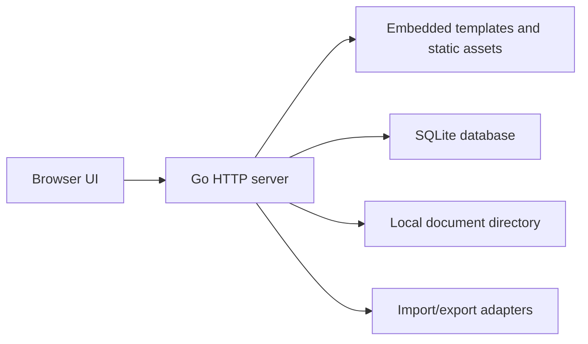

# Architecture

JobHunt OS is local-first, portable, and dependency-limited.

## Principles

- Private by default: user data lives on the user's machine unless they explicitly export or sync it.
- Manual first: the core product should work without email automation, scraping, AI, or background agents.
- Small trusted base: prefer the Go standard library and explicit code over broad frameworks.
- Portable install: Docker Compose with the public container image and a local data directory is the canonical end-user path today; direct source or binary usage can remain a local or future option.
- Escape hatch: import and export must support migration away from the app.

## Runtime Shape

## Runtime

- `cmd/jobhunt-os`: binary entry point
- `internal/server`: HTTP routes, templates, middleware, exports, and file handling
- `internal/store`: storage interfaces and SQLite implementation
- `migrations`: embedded schema migrations
- `web`: server-rendered templates and static assets
- `fixtures`: synthetic examples for UI and tests

## Data Domains

- Applications: company, role, source, status, priority, typed compensation, location, notes, and next action.
- Contacts: recruiters, hiring managers, interviewers, referrers, and other people connected to one or more applications.
- Documents: resumes, cover letters, snippets, work samples, versions, and application attachments.
- Correspondence: dated notes for emails, calls, messages, recruiter updates, and hiring-team feedback.
- Events: interviews, take-home assignments, deadlines, follow-ups, decisions, and contact-linked timeline entries.
- Outcomes: accepted, declined, rejected, withdrawn, archived, and lessons learned.

## Persistence Notes

SQLite is the durable store. Migrations are embedded in the binary. Foreign key
enforcement is enabled through the SQLite DSN for each connection.

## Security Boundaries

The app binds to localhost by default, has no built-in accounts, and stores data
under a user-controlled data directory. State-changing forms use CSRF tokens.
Network-exposed deployments need authentication at the reverse proxy or another
external access-control layer.
