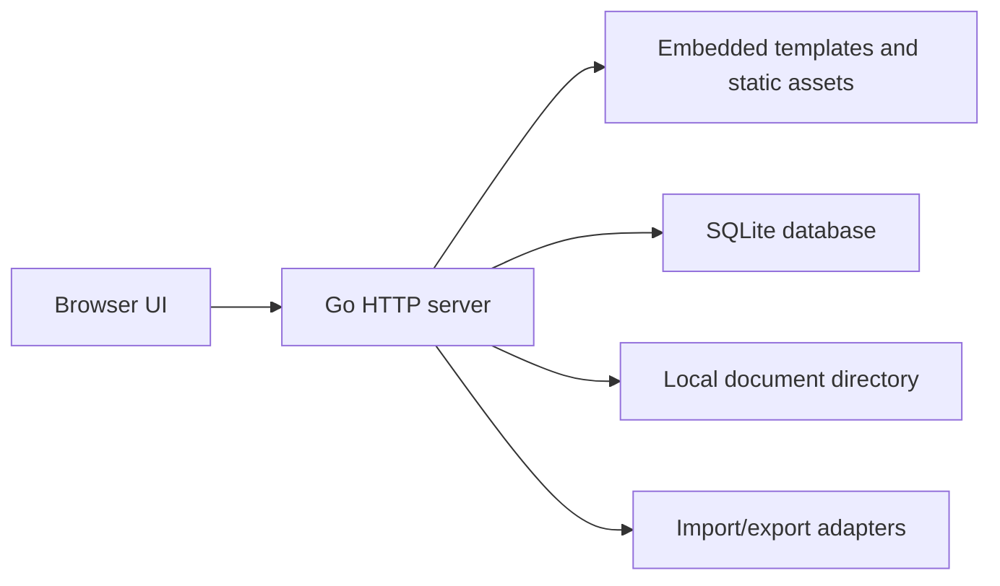

# Architecture

JobHunt OS should remain local-first, portable, and dependency-minimized.

## Principles

- Private by default: user data lives on the user's machine unless they explicitly export or sync it.
- Manual first: the core product should work well without email automation, scraping, AI, or background agents.
- Small trusted base: prefer the Go standard library and explicit code over broad frameworks.
- Portable install: Docker Compose with the public container image and a local data directory is the canonical end-user path today; direct source or binary usage can remain a local or future option.
- Escape hatch: import and export must be first-class so users never feel trapped.

## Proposed Shape

## Runtime

- `cmd/jobhunt-os`: binary entry point
- `internal/server`: HTTP routes, templates, and middleware
- `internal/store`: planned persistence layer around explicit SQL
- `migrations`: planned embedded schema migrations
- `web`: server-rendered templates and static assets
- `fixtures`: synthetic examples for UI and tests

## Data Domains

- Applications: company, role, source, status, priority, typed compensation, location, notes, and next action.
- Contacts: recruiters, hiring managers, interviewers, referrers, and other people connected to one or more applications.
- Documents: resumes, cover letters, snippets, work samples, versions, and application attachments.
- Correspondence: dated notes for emails, calls, messages, recruiter updates, and hiring-team feedback.
- Events: interviews, take-home assignments, deadlines, follow-ups, decisions, and contact-linked timeline entries.
- Outcomes: accepted, declined, rejected, withdrawn, archived, and lessons learned.

## Persistence Notes

The initial migration is the source of truth until real data exists. SQLite foreign key enforcement is connection-local, so the future store must enable `PRAGMA foreign_keys = ON` immediately after opening each database connection.

## Security Boundaries

The first release should bind to localhost by default, avoid accounts entirely, and store data under a user-controlled data directory. Any future network mode needs authentication, CSRF protection, rate limits, and a separate threat model.
